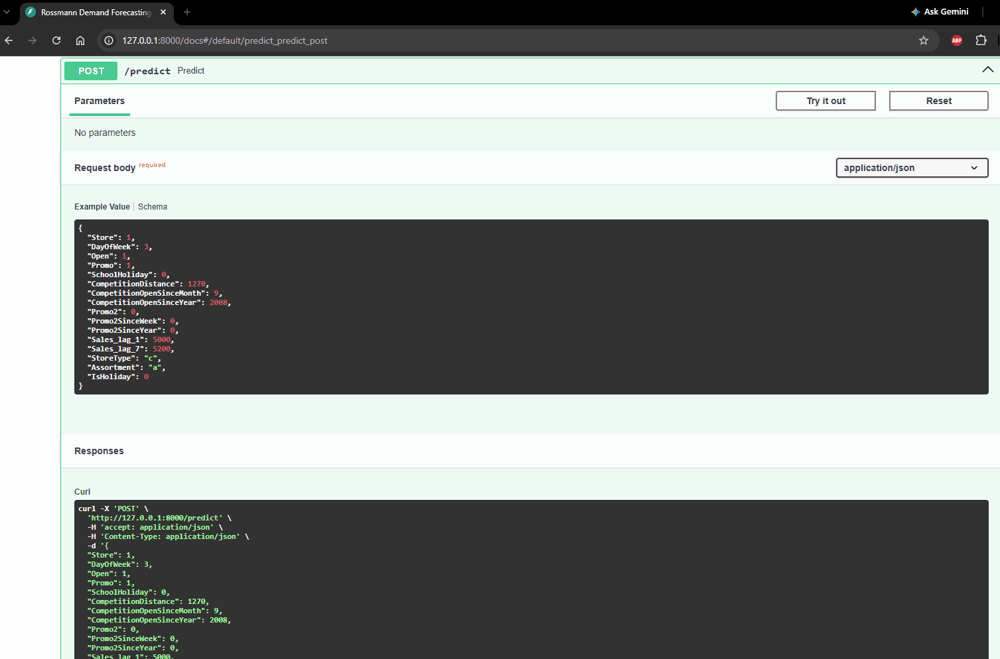

# Intelligent Demand Forecasting

A retail demand forecasting project built to demonstrate statistical analysis, time series forecasting, and machine learning skills, grounded in my professional background as a workforce management (WFM) forecast analyst.

**Dataset:** Rossmann Store Sales (Kaggle)

**Background:** I currently work as a WFM forecast analyst and am pursuing an M.D.A. in Data Analytics at Penn State. This repo is where I'm applying coursework to a real, self-directed forecasting problem as I build toward a data science career.

**Status:** Core analysis complete (R). Python pipeline complete: ingestion, feature engineering, MLflow-tracked training, evaluation, and a FastAPI serving layer, containerized with Docker. Executive summary available.

**For a non-technical summary of this project, see [EXECUTIVE_SUMMARY.md](./EXECUTIVE_SUMMARY.md).**

## A Note on Tooling

This project was built with the assistance of Claude (Anthropic) for code drafting, debugging, and analytical framing throughout. All modeling decisions, hypothesis testing, and interpretation of results reflect my own analysis and understanding of both R and the underlying statistics.

## Structure

- `data/raw/` — original, unmodified source data
- `data/processed/` — cleaned data ready for analysis
- `R/` — R Markdown notebooks (business understanding, EDA, baseline forecasting, feature modeling, evaluation)
- `python/` — Python pipeline: ingest, feature engineering, training, evaluation, and a FastAPI serving layer
- `docs/` — knitted HTML output (for easy reading without R) and `project_journal.md`

## Roadmap

- [x] Repo setup
- [x] Business understanding
- [x] Exploratory data analysis
- [x] Baseline forecast models (SNAIVE, ETS, ARIMA)
- [x] Feature-based models (GLM, Random Forest)
- [x] Model evaluation, business impact, and final recommendation
- [x] Python pipeline: ingestion, feature engineering, MLflow-tracked training, evaluation
- [x] FastAPI serving layer with a working `/predict` endpoint
- [x] Dockerized the API

## Running the Prediction API

1. **Train a model** (produces `python/models/model.pkl`, not included in the repo):